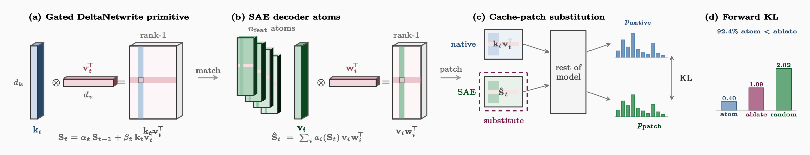

# WriteSAE: Sparse Autoencoders for Recurrent State

<div align="center">

[Jack Young](https://www.jackyoung.io)

[](https://arxiv.org/abs/2605.12770)
[](https://www.jackyoung.io/research/writesae)
[](https://huggingface.co/JackYoung27/writesae-ckpts)
[](LICENSE)

</div>

<p align="center">
  
</p>

***TL;DR:*** WriteSAE is a sparse autoencoder for what Mamba-2, RWKV-7, and Gated DeltaNet write into their matrix cache. Its atoms substitute for the model's own cache writes on **92.4%** of evaluated positions.

Residual-stream SAEs cannot replace a matrix cache write because their atoms are vectors. WriteSAE atoms are rank-1 outer products $v_i w_i^\top$, shaped like the native $k_t v_t^\top$ write. A closed-form formula in the forget gate, read query, and output embedding predicts each atom's logit shift at *R²*=0.98 with no fitted parameters. The same substitution test reaches 88.1% on Mamba-2-370M, and writing the formula's chosen direction at three consecutive cache positions raises target-token inclusion from 33.3% to 100% for tokens the unmodified model ranks between 100 and 1000.

## Installation

```bash
git clone https://github.com/JackYoung27/writesae
cd writesae
conda create -n writesae python=3.10 -y && conda activate writesae
pip install -e .
```

Optional backends:

```bash
pip install flash-linear-attention   # DeltaNet, GLA
pip install mamba-ssm causal-conv1d   # Mamba-2
```

Tested Python 3.10/3.11, torch 2.8, CUDA 12.1.

## Quick Start

```bash
# 1. Extract GDN states from the base model
python -m experiments.extraction.extract_states \
    --model Qwen/Qwen3.5-0.8B --layers 9 --n_samples 50000 --output_dir states

# 2. Train a single WriteSAE on one head (~10 min on 1x A10G)
python -m core.train --sae_type bilinear --layer 9 --head 4 \
    --n_features 2048 --k 32 --data_dir states --output_dir ckpt

# 3. Analyze
python -m experiments.analysis.analyze \
    --sae_checkpoint ckpt/best.pt --data_dir states --layer 9 --head 4
```

[`REPRODUCE.md`](REPRODUCE.md) maps every numbered figure and table to its driver script. [`MODEL_CARD.md`](MODEL_CARD.md) documents the checkpoint variants on HuggingFace.

## Results

| Test | Model | *n* | Win rate |
| --- | --- | ---: | ---: |
| Single-atom substitution | Qwen3.5-0.8B (GDN, L9 H4) | 4,851 | **92.4%** |
| 87-atom population test | Qwen3.5-0.8B (GDN, L9 H4) | 87 | 89.8% |
| Cross-architecture substitution | Mamba-2-370M | 2,500 | 88.1% |
| Closed-form prediction of logit shift | Qwen3.5-0.8B | n/a | *R²*=0.98 |

Full ablations and the behavioral install in the paper: [arXiv:2605.12770](https://arxiv.org/abs/2605.12770).

## Citation

```bibtex
@article{young2026writesae,
  title   = {WriteSAE: Sparse Autoencoders for Recurrent State},
  author  = {Young, Jack},
  journal = {arXiv preprint arXiv:2605.12770},
  year    = {2026}
}
```

## Acknowledgments

This project builds on open mechanistic interpretability research, particularly Anthropic's Transformer Circuits Thread and the public sparse-autoencoder line. Thanks to that community for working in the open.

## License

Released under [MIT](LICENSE).
